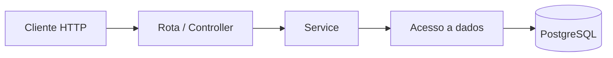

# Arquitetura

A entrada HTTP é criada por `server.ts`, que carrega o ambiente, monta as dependências e inicia o servidor. `app.ts` registra as rotas e coordena as respostas. À medida que o domínio crescer, controllers devem tratar HTTP, services devem concentrar regras de negócio e módulos de acesso a dados devem conversar com o PostgreSQL.

O pool compartilhado em `shared/database.ts` é o ponto mínimo de acesso ao banco. Tipos de domínio ficam nos módulos `merchants` e `transactions`.

Cada camada deve manter uma responsabilidade clara: HTTP traduz requisições e respostas, services implementam decisões do domínio e a camada de dados isola consultas e persistência.
